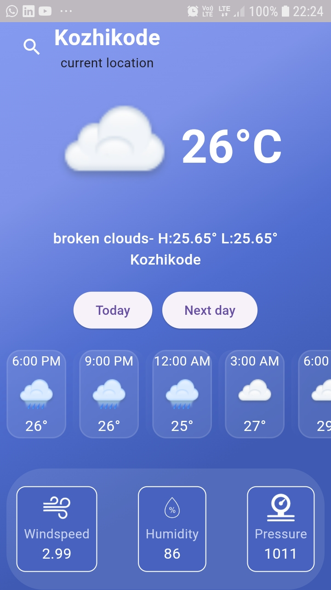
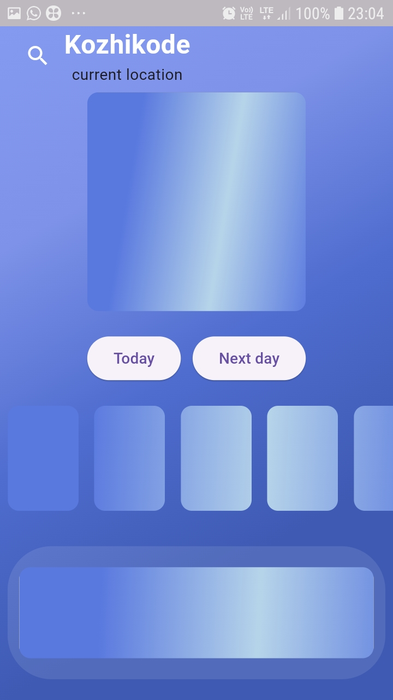

# WeatherApp

A Flutter-based mobile application that fetches and displays weather data for a specified location. Users can search for weather data by city and get real-time updates. The app supports multiple temperature units (Celsius and Fahrenheit), includes a forecast for upcoming hours, and provides a sleek shimmer effect while loading data.

## Features

- **Live Weather Data**: Get the current weather and forecast for your location or any city by searching for it.
- **Search Functionality**: Search for weather data by entering a city name, and get real-time weather updates for that location.
- **Temperature Conversion**: Switch between Celsius and Fahrenheit by tapping the temperature display.
- **Shimmer Loading Effect**: Smooth shimmer animation shown while weather data is being fetched.
- **Responsive Design**: Adaptable layout to different screen sizes.
- **Hourly Forecast**: View the weather forecast for the next few hours with detailed weather conditions.
- **Error Handling**: Informs the user when the city cannot be found or when there's a network issue.
# How to Run the App  
### Prerequisites  
- Flutter SDK installed on your machine.  
- An IDE like Android Studio or VS Code with Flutter and Dart plugins.  
- API Key for the weather data provider (OpenWeatherMap/Weather API).  
### Setup   
- Clone the repository:
git clone https://github.com/muhammed-shadil/Weather-App
- Navigate to the project directory:
cd flutter-weather-app
- Install dependencies:
`flutter pub get  `
- Add your API key to the appropriate file (e.g., in the lib/services/weather_service.dart):
const String apiKey = 'YOUR_API_KEY';
- Run the app on your device:
`flutter run  `
### Screenshots  

### Dependencies:
- Flutter
- Dart
- OpenWeatherMap API 
- Geaolocator and Geocoding
- BLoC State Management

### Weather API
This app uses OpenWeatherMap API. Make sure to sign up and get your API key to fetch weather data.  

### APK File
You can download the .apk file [here](https://drive.google.com/file/d/1zQwTmfeQ5zDkGvPiN7KGaf21J_PA0av9/view?usp=sharing).